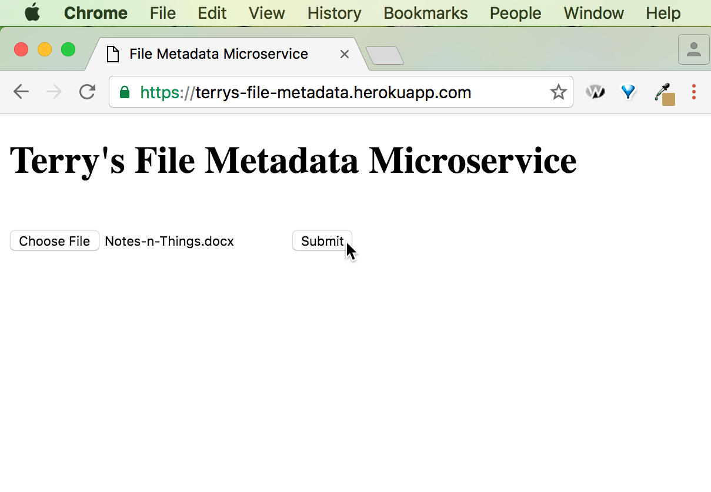

https://terrys-file-metadata.herokuapp.com/

A microservice that lets users upload a file and outputs the size of that file in bytes. 

For example: I upload a TextEdit file in which I have recorded all of my life aspirations. It is 421446 bytes big. My browser spits out: {"size":"421446 Bytes"}. Thanks!

